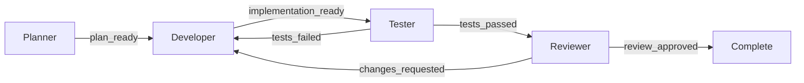

# Multi-Agent Software Task Workflow

Status: Phase 1 supported reference workflow

`multi-agent-software-task` is Prism's first supported end-to-end multi-agent
workflow. It coordinates configured Prism agents through a fixed, bounded
software-delivery loop while keeping routing, budgets, persistence, policy,
approval, validation, and terminal decisions under runtime control.

This is a supported reference flow, not a general graph-authoring interface.
Its runtime contracts and recovery model are defined in
[Multi-Agent Loop Runtime Contracts](architecture/MULTI_AGENT_LOOP_RUNTIME.md).
If you want to author your own role/outcome workflow graph instead of using
this fixed flow, see [Developer-Authored Workflow Graphs](workflows/README.md)
— this exact workflow's shape is also available as a shipped, hand-authored
YAML template (`templates/software-delivery.yaml`), see
[Migrating from the Phase 1 built-in workflow](workflows/migration-from-phase-1.md).

## Workflow contract



Agents return typed outcomes and structured handoffs. They do not select an
arbitrary next node. Prism resolves the one declared transition, checkpoints
it, and applies the next budget check before entering another role.

The four logical roles are independent of configured agent IDs. The default
profile references are `planner`, `developer`, `tester`, and `reviewer`;
deployments may override those references in the run input. The effective
developer and reviewer profiles must be distinct. This prevents a mutating
agent from acting as its own review authority.

## Start a run

Create a JSON input document:

```json
{
  "objective": "Add the accepted cache invalidation behavior",
  "workspace": "D:/projects/example",
  "constraints": [
    "preserve the public API",
    "do not add dependencies"
  ],
  "acceptance_criteria": [
    "unit and integration tests pass",
    "the reviewer approves the final diff"
  ],
  "role_profiles": {
    "planner": "astraea",
    "developer": "forge",
    "tester": "atlas",
    "reviewer": "muse"
  }
}
```

Then run:

```text
prism workflow run multi-agent-software-task --input task.json --config prism.yaml
```

`objective` and `workspace` are required. Unknown input fields are rejected.
The workspace must already exist and be a directory. Prism canonicalizes its
path, derives a stable identity, persists both before execution, and rejects a
resume if the identity changes.

The command writes and prints the run ID before invoking a provider. If the
process is interrupted after that point, use the same ID with `status` or
`resume`.

## Control plane

All Phase 1 operations extend the existing `prism workflow` command:

```text
prism workflow status <run-id> [--json] [--run-dir ./runs]
prism workflow cancel <run-id> [--reason "operator stop"] [--run-dir ./runs]
prism workflow resume <run-id> [--config prism.yaml] [--run-dir ./runs]
prism workflow report <run-id> [--json] [--run-dir ./runs]
```

`status` is read-only. `cancel` persists an operator request without waiting
for the execution claim; an active owner stops at the next role boundary, and
an idle run becomes terminal immediately. `resume` obtains the exclusive run
claim and advances only from a safe checkpoint. `report` is available only
after a run reaches a terminal state.

Existing named-step workflow commands retain their prior behavior. Prism
detects multi-agent runs by their persisted manifest and routes only those
runs through the Phase 1 control plane.

`prism serve`'s dashboard also exposes read-only inspection plus pause/
resume/cancel for a run from the browser, backed by the same underlying
operations described here. See
[Multi-Agent Execution Graph Dashboard](architecture/MULTI_AGENT_EXECUTION_GRAPH.md#operator-controls)
for its behavior and current limitations (notably: no Approve/Reject there,
and mutating requests/the live stream do not carry an auth token today).

## Safety ceilings

The built-in limits are intentionally conservative:

| Limit | Ceiling |
| --- | ---: |
| Transitions | 12 |
| Planner visits | 1 |
| Developer visits | 4 |
| Tester visits | 3 |
| Reviewer visits | 2 |
| Tester-to-developer loops | 2 |
| Reviewer-to-developer loops | 1 |
| Repeated failures | 2 |
| Retries | 4 |
| Total local iterations | 24 |
| Total tokens | 60,000 |
| Run duration | 45 minutes |

An input may lower a ceiling but cannot raise one:

```json
{
  "objective": "Fix the bounded defect",
  "workspace": ".",
  "budgets": {
    "max_transitions": 8,
    "max_tokens": 40000,
    "max_duration": "30m",
    "max_visits_per_role": {
      "developer": 3,
      "tester": 2
    }
  }
}
```

Zero, negative, unknown, or widening overrides fail before a run is created.
Budget exhaustion is a durable terminal outcome; it is not an invitation for
an agent to continue outside the supervisor.

## Authority model

Planner, tester, and reviewer receive read-oriented tools. Developer may also
use dry-run and proposal tools. The selected workspace is the only read and
write root supplied to the reference flow.

Developer proposals still pass through Prism's existing tool policy and
durable approval store. An agent's output cannot approve its own mutation.
The tester invokes only named, allowlisted validation profiles; Phase 1 uses
`go_test_all`. Validation commands and policy decisions remain owned by their
existing domains, not by the multi-agent supervisor.

Role-profile overrides change execution identity only. They cannot add a role,
transition, tool, capability, validator, approval authority, or graph edge.

## Durable artifacts

Each run uses the selected run directory:

```text
<run-dir>/<run-id>/
  multiagent.db
  multiagent_manifest.json
  multiagent_report.json
  validation/
```

`multiagent_manifest.json` records the schema version, validated input,
effective definition, canonical workspace path, and workspace identity. It is
the immutable resume contract. `multiagent.db` contains the package-owned run,
outbox, cancellation, and canonical event tables. `multiagent_report.json` is
written for terminal runs and may be regenerated deterministically from
durable state and canonical events.

The terminal report includes:

- original objective;
- planner and implementation summaries;
- deduplicated artifacts;
- test and review outcomes;
- correction-loop history;
- token, iteration, retry, failure, and elapsed accounting;
- warnings; and
- the typed terminal condition.

Provider prompts and raw model output are not copied into durable runtime
state or the report.

## Recovery behavior

| Persisted condition | Resume behavior |
| --- | --- |
| Pending role | Check cancellation and budgets, then enter the role |
| Completed role with transition pending | Apply the persisted transition without rerunning the role |
| Safe external wait | Recheck the same visit |
| Uncertain in-flight execution | Pause for reconciliation; do not repeat a possible mutation |
| Cancellation requested | Stop before the next role |
| Terminal state | Return unchanged; execute no role |
| Corrupt or future schema | Fail closed |
| Workspace identity mismatch | Fail closed |

Only one process may advance a run at a time. Phase 1 uses the existing
single-host file lock and SQLite compare-and-set revisions. State changes and
their event outbox records commit atomically; publication is idempotent.

## Supported scope and limitations

Phase 1 supports one local, sequential, four-role workflow. It does not expose
arbitrary graph authoring, parallel role execution, distributed leases,
dynamic agent creation, or automatic reconciliation of uncertain external
effects. A process crash during an unconfirmed mutation may require an
operator to inspect the workspace before choosing a recovery action.

The workflow requires configured agent profiles whose declared capabilities
cover their assigned roles. Provider availability, credentials, and model
quality remain deployment concerns. A terminal report records what Prism can
prove from durable state and canonical events; it is not a substitute for
human review where policy requires human authority.
