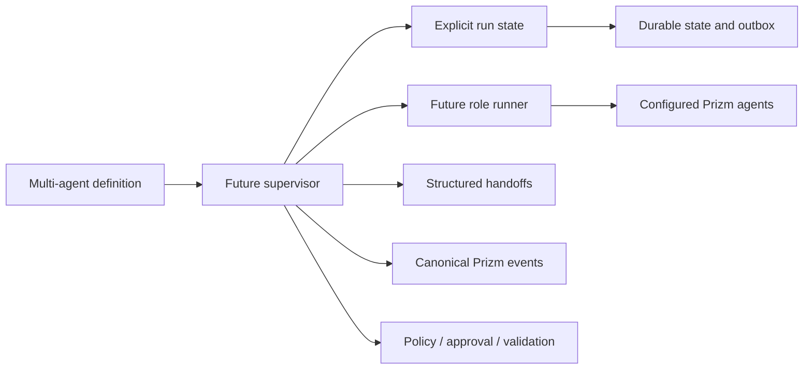
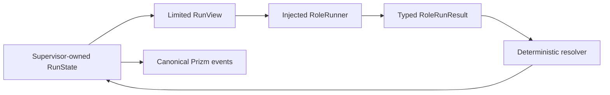
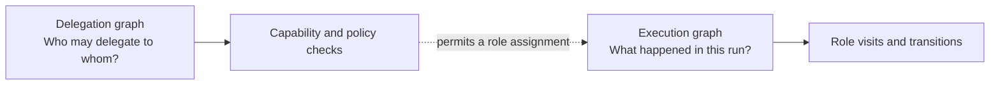

# Multi-Agent Loop Runtime Contracts

Status: Phase 1 complete reference runtime

This document defines the canonical vocabulary and ownership boundaries for
Prizm's bounded multi-agent loop runtime. The contract baseline arrived in PR2;
PR3 adds deterministic in-memory supervision; PR4 connects configured Prizm
agents to that supervisor through the existing bounded sub-agent execution
domain; and PR5 adds durable checkpoints, exclusive claims, idempotent event
publication, recovery, and safe resume. PR6 composes those foundations through
the existing `prizm workflow` control plane as the supported
`multi-agent-software-task` reference flow.

The contracts follow [Package Boundaries](PACKAGE_BOUNDARIES.md) and preserve
the authority model in
[ADR 0001](decisions/0001-runtime-owns-authority.md).

## Purpose

Phase 1 introduces one governed reference flow:

```text
Planner -> Developer -> Tester -> Reviewer -> Complete
               ^          |           |
               |          | failed    | changes requested
               +----------+-----------+
```

The flow is intentionally bounded. Roles may perform local iterations, but
Prizm owns global routing, budgets, terminal outcomes, and the durable state
required for eventual recovery.

This contract baseline makes later implementation PRs depend on one vocabulary
instead of inventing incompatible role names, statuses, handoffs, transition
outcomes, budget semantics, or event payloads.

## Package placement decision

Package: `internal/workflow/multiagent`

Domain statement: owns canonical contracts, deterministic supervision, and
domain-specific persistence and recovery for bounded multi-agent workflows.

Invariants owned:

- Phase 1 role and outcome vocabulary;
- role configuration validity;
- deterministic transition-rule shape;
- structured handoff validity;
- explicit run and role state validity;
- terminal-condition consistency;
- fail-closed budget configuration;
- deterministic transition selection;
- bounded correction-loop traversal;
- checkpoint and resume semantics;
- run-level execution-key idempotency;
- atomic state and outbox publication; and
- single-owner execution claims.

Primary callers:

- the real Prizm agent adapter introduced in PR4;
- the persistence and recovery boundary introduced in PR5; and
- composition roots that start a multi-agent run.

Allowed dependencies:

- the Go standard library;
- `internal/cost` for the existing token-usage contract;
- `internal/retry` for the existing retry policy;
- `internal/validation` for existing validation results;
- `internal/event` for the canonical Prizm event envelope and vocabulary;
- `internal/agent` for configured agent identity;
- `internal/subagent` for bounded agent execution;
- `internal/workflow/v2` for the existing delegated-task execution contract;
- `internal/run` for the existing single-host run lock; and
- `internal/sqlite` for Prizm's registered SQLite driver and connection policy.

Responsibilities explicitly excluded:

- selecting agents independently of role configuration;
- implementing model-provider clients or tool execution;
- owning generic database lifecycle or persistence for other domains;
- inventing a second event store, lock implementation, or SQLite driver;
- evaluating policy;
- recording approvals;
- running validation commands;
- managing worktrees; and
- transporting delegated work outside the existing sub-agent boundary.

Existing packages considered:

- `internal/workflow`;
- `internal/workflow/v2`;
- `internal/delegation`; and
- `internal/subagent`.

Those packages do not own this contract domain. `workflow` is the generic
ordered workflow engine. `workflow/v2` owns the current Natural Gates runtime.
`delegation` owns capability-gated task routing. `subagent` owns bounded agent
execution. Putting the new contracts into one of those packages would either
couple the supervisor to an existing execution engine or make an
execution/transport package the owner of workflow semantics.

Test boundary: contract validation and JSON round trips are tested without
NATS, SQLite, providers, worktrees, or live agents.

## System context



`internal/workflow/multiagent` owns the definition, state, and handoff
contracts. The supervisor owns orchestration. `internal/event` owns
event names and payload schemas. Existing governance packages retain authority.

## Terminology

| Term | Meaning |
| --- | --- |
| Role | A logical workflow responsibility, independent of a concrete agent ID |
| Role configuration | The mapping from a logical role to an existing agent or profile and its bounds |
| Local iteration | One bounded attempt performed within a role |
| Visit | One entry into a role; correction loops create additional visits |
| Handoff | Structured context transferred from one role to the next |
| Transition outcome | A typed result returned by a role for Prizm to route |
| Transition rule | A declared mapping from role and outcome to a role or terminal condition |
| Traversal | One selected transition in the execution history |
| Run state | The complete logical state required to observe and eventually resume a run |
| Terminal condition | The typed reason that no further role may execute |
| Delegation graph | The permission relationships governing which agents may delegate to which targets |
| Execution graph | The actual role and transition history of one run |

## Responsibilities and boundaries

| Concern | Owner |
| --- | --- |
| Role, outcome, handoff, budget, state, checkpoint, and recovery invariants | `internal/workflow/multiagent` |
| Generic workflow execution | `internal/workflow` |
| Natural Gates execution | `internal/workflow/v2` |
| Agent identity and configured profiles | Existing agent and orchestrator domains |
| Capability-gated delegation | `internal/delegation` |
| Bounded sub-agent execution | `internal/subagent` |
| Event envelope, names, and payload schema | `internal/event` |
| Authorization decisions | `internal/policy` |
| Human authorization records | `internal/approval` |
| Allowlisted verification | `internal/validation` |
| Shared SQLite registration and connection policy | `internal/sqlite` |
| Single-host execution exclusion | `internal/run` |

The multi-agent package composes these existing boundaries without absorbing
their authority or creating helper-category packages.

## Role contracts

The initial logical roles are:

- `planner`;
- `developer`;
- `tester`; and
- `reviewer`.

A role is not an agent. `AgentRef` identifies an existing Prizm agent or
profile that a later adapter resolves. This separation allows a deployment to
change its configured agents without changing workflow meaning.

Each role configuration records:

- the logical role;
- the agent or profile reference;
- allowed tools and required capabilities;
- maximum local iterations;
- token and time budgets;
- the existing Prizm retry policy;
- approval requirements; and
- validation-profile references.

Tool names, capabilities, agent references, and validation profiles remain
references. The PR4 adapter resolves configured agents against Prizm's agent
registry and supplies the references to their existing authority domains. The
contract validates shape; the adapter validates that the resolved agent has
every required capability and preserves tool and validation references for
enforcement by their owners.

Approval requirements name approver roles. A role cannot name itself as an
approver. The configuration only expresses workflow routing; the approval
package remains responsible for recording and resolving human authority.

## Role and run statuses

Role execution statuses are explicit:

| Status | Meaning |
| --- | --- |
| `pending` | The role has not entered its current visit |
| `running` | The role is performing bounded local work |
| `waiting` | The role awaits an external governed condition |
| `completed` | The role produced a valid outcome |
| `failed` | The role could not complete its work |
| `blocked` | A required condition prevents progress |
| `cancelled` | The role stopped because the run was cancelled |

Run status is separate because one role can fail while the run enters a
correction loop. Terminal run statuses are `completed`, `failed`, `cancelled`,
and `budget_exhausted`. `created`, `running`, and `paused` remain resumable
logical states.

## Structured handoffs

A handoff is the primary contract between roles. It contains:

- handoff and run IDs;
- source and destination roles;
- a task reference and objective;
- typed artifact and evidence references;
- a typed transition outcome and reason;
- existing Prizm validation results;
- structured unresolved issues; and
- a creation timestamp.

Artifact references identify files, commits, pull requests, reports, or
validation artifacts without embedding their content in workflow state.
Free-form notes are permitted as supplemental context, but notes cannot select
a destination or outcome.

A valid handoff must:

- reference roles present in the definition;
- match a declared non-terminal transition;
- use a supported outcome for its source role;
- use different source and destination roles unless the definition explicitly
  permits self-transitions;
- contain a task, objective, transition reason, and timestamp; and
- contain valid artifact, validation-result, and issue structures.

## Transition outcomes

Agents report typed outcomes. They do not name arbitrary destinations. The
supervisor matches an outcome to a validated transition rule.

| Source role | Outcome | Phase 1 meaning | Reference result |
| --- | --- | --- | --- |
| Planner | `plan_ready` | A structured implementation plan is ready | Developer |
| Developer | `implementation_ready` | Implementation and evidence are ready for testing | Tester |
| Tester | `tests_passed` | Required validation passed | Reviewer |
| Tester | `tests_failed` | Validation failed and requires correction | Developer |
| Reviewer | `review_approved` | Independent review approves completion | Complete |
| Reviewer | `changes_requested` | Review requires correction | Developer |
| Any configured role | `terminal_failure` | The run cannot continue safely | Failed |
| Any configured role | `cancelled` | Cancellation was requested | Cancelled |

Contract validation rejects:

- unknown roles or outcomes;
- outcomes emitted by the wrong role;
- routes with both a destination and terminal condition;
- routes with neither;
- duplicate routes for the same role and outcome;
- undeclared transitions;
- non-terminal outcomes used as terminal outcomes; and
- self-transitions unless explicitly allowed.

Transition selection is owned by the PR3 supervisor and uses typed outcomes only.

## State ownership

The supervisor is the single logical writer of multi-agent run state.
Agents return role results and handoffs; they do not mutate global state.

`RunState` records:

- a state schema version;
- run and workflow definition identity;
- current role, task, and stable workspace identity;
- run status;
- per-role status, visits, local iterations, retries, token usage, elapsed time,
  latest outcome, execution key, workspace, validation, approval, and artifacts;
- total transition and correction-loop traversal counts;
- accumulated token, iteration, retry, failure, and elapsed-time usage;
- creation, update, and completion timestamps;
- the latest structured handoff and latest completed role;
- an optional cancellation reason; and
- a typed terminal outcome.

State validation requires every configured role to have an explicit role state.
Counters and usage cannot be negative. Terminal status, condition, completion
timestamp, and reason must agree. Active states cannot carry a terminal
outcome.

PR5 persists this state in a package-owned SQLite table. Persistence retains
the domain contract while reusing Prizm's SQLite registration, WAL policy, and
single-host run lock rather than moving multi-agent invariants into a generic
storage or helper package.

## Budget model

Budgets exist at run and role levels.

| Budget | Scope |
| --- | --- |
| Maximum transitions | Whole run |
| Maximum visits per role | Whole run, keyed by role |
| Maximum local iterations | Whole run and per role |
| Maximum retries | Whole run; role retry policy may be stricter |
| Maximum tokens | Whole run and per role |
| Maximum repeated failures | Whole run |
| Maximum tester-to-developer traversals | Tester correction loop |
| Maximum reviewer-to-developer traversals | Reviewer correction loop |
| Maximum duration | Whole run and per role |

Count and token limits use a fail-closed convention:

- a positive value is a bounded ceiling;
- `-1` is explicitly unlimited; and
- `0` and values below `-1` are invalid.

Duration limits use the same positive-or-`-1` rule. The existing
`retry.RetryConfig` retains its established convention that zero retries means
no retry.

Budget exhaustion is not a generic failure string. It is represented by the
typed `budget_exhausted` run status and terminal condition and has a dedicated
canonical event.

## Event model

Multi-agent events use the existing `event.Event` envelope, metadata,
correlation IDs, parent IDs, event store, and opt-in payload validation. The
supervisor emits this vocabulary through an injected sink; it does not
introduce another event bus or envelope.

The namespace is `prizm.workflow.multi_agent.*`.

| Event | Payload contract |
| --- | --- |
| `run.created` | Run ID, workflow ID, status |
| `run.started` | Run ID, workflow ID, status |
| `role.entered` | Run, workflow, role, status, visit |
| `role.iteration.started` | Run, workflow, role, status, iteration |
| `role.iteration.completed` | Role iteration plus optional outcome, usage, error, and artifacts |
| `role.completed` | Role, status, outcome, and optional evidence summary |
| `handoff.created` | Handoff, source, destination, task, and outcome |
| `transition.selected` | Source, outcome, destination or terminal condition, transition count |
| `loop.traversal.recorded` | The selected traversal and accumulated transition count |
| `budget.warning` | Budget name, used value, limit, and optional role |
| `budget.exhausted` | Exhausted budget and typed terminal reason |
| `run.paused` | Run identity, paused status, and optional reason |
| `run.resumed` | Run identity, resumed status, and optional reason |
| `run.completed` | Completed status and terminal condition |
| `run.failed` | Failed status, terminal condition, and reason |
| `run.cancelled` | Cancelled status, terminal condition, and reason |

The full canonical names and typed payload structs live in `internal/event`.
Their required fields are registered with the existing `event.Schemas` map.

## Deterministic supervisor

`Supervisor` executes the validated Phase 1 definition in memory. A
`TransitionResolver` maps only the pair `(current role, typed outcome)` to one
declared destination or terminal condition. Free-form role output never
participates in route selection.



### Role runner boundary

A role runner receives:

- a copy-only `RunView` with identity, task, counters, usage, and the incoming
  handoff;
- the current `RoleConfig`; and
- the execution context.

It returns a typed outcome, a routing-free handoff draft, token and iteration
usage, retry accounting, execution metadata, and an error. The handoff draft
contains artifacts and evidence but no source or destination role. The
supervisor resolves the edge and constructs the canonical `Handoff`.

### Supervisor invariants

For every run:

- only the supervisor mutates `RunState`;
- exactly one declared transition is selected for a valid role outcome;
- a runner cannot name or mutate the next role;
- visit, transition, loop, iteration, retry, token, and elapsed-time accounting
  is explicit;
- every configured limit is checked before another role can execute;
- terminal state, condition, timestamp, and event agree;
- cancellation is checked between role executions and after runner return; and
- no role executes after completion, failure, cancellation, or budget
  exhaustion.

### Event ordering

A successful non-terminal visit emits:

```text
role.entered
role.completed
handoff.created
transition.selected
loop.traversal.recorded  # correction edges only
```

A run begins with `run.started`. Its final event is `run.completed`,
`run.failed`, `run.cancelled`, or `budget.exhausted`, according to the typed
terminal state. Runner errors and invalid outcomes fail deterministically;
budget exhaustion records the attempted usage and does not select the
over-budget transition.

## Workflow-engine relationship

The multi-agent runtime is workflow-first. It is composed as a workflow
capability and does not replace either existing workflow engine.

- `internal/workflow` continues to own generic named-step execution.
- `internal/workflow/v2` continues to own Natural Gates behavior and state.
- `internal/workflow/multiagent` owns stable contracts, deterministic
  supervision, persistence, recovery, and the fixed Phase 1 workflow
  definition.
- `cmd/prizm-cli` is the composition root. It wires configured agents,
  providers, governed tools, approvals, validation, SQLite state, events, and
  run claims without taking ownership of their domain rules.
- `multi-agent-software-task` is the only supported Phase 1 product workflow.
  Existing named-step and Natural Gates behavior is unchanged.

## Delegation graph and execution graph

The graphs answer different questions:



The delegation graph governs permission. It contains agent relationships and
capability constraints. The execution graph records runtime progress: role
visits, outcomes, correction loops, and terminal state.

An execution edge is valid only when delegation and governance permit the
underlying assignment. Permission does not imply that the edge executed, and
an executed edge does not grant new delegation authority. The graphs are
related but never interchangeable.


## Real Prizm agent adapter

`AgentRoleRunner` is the Phase 1 integration boundary between deterministic
supervision and real Prizm agent execution. It remains in
`internal/workflow/multiagent` because it translates this domain's role,
handoff, outcome, and budget contracts. It does not establish a new package or
a second agent runtime.

The adapter delegates bounded execution to `internal/subagent.TaskRunner`.
Production composition uses the existing `subagent.LoopRunner`, worker, and
tool executor path. This seam was selected because it already owns local agent
iterations, provider invocation, tool dispatch, cancellation, and execution
telemetry. Calling a provider directly would bypass Prizm's tool, policy, and
approval path; adding another runner would duplicate an existing domain.

The ownership chain is:

```text
Supervisor
    |
    | typed RoleRunRequest
    v
AgentRoleRunner
    | resolve configured profile, workspace, and governed prerequisites
    | construct role-scoped prompt and strict output contract
    v
SubagentExecutor
    | TaskPacket + AgentRuntime
    v
subagent.TaskRunner
    | bounded model/tool loop
    v
tool.Executor.ExecuteWithPolicy
    | policy decision, approval path, audited tool execution
    v
typed RoleRunResult
```

### Structured role outputs

Each logical role has a versioned JSON output schema. The adapter rejects
unknown fields, trailing values, missing required evidence, invalid status
combinations, and handoffs that contradict a terminal result.

- Planner output carries understanding, an implementation plan, task
  breakdown, acceptance criteria, and a developer handoff.
- Developer output carries a summary, changed artifact references, and a
  tester handoff.
- Tester output carries executed checks and exactly one result. A failed result
  requires a developer handoff; a passed result requires a reviewer handoff.
- Reviewer output carries a decision, findings, required corrections, and
  evidence. Approval is terminal and cannot include a handoff. Requested
  changes require a developer handoff.

Agents describe work and evidence; they do not choose arbitrary destinations.
The decoder maps valid role output to one of the canonical outcomes, and the
supervisor's transition table remains the only routing authority.

### Governance and workspace behavior

The adapter fails closed at every authority boundary:

- the configured agent must exist and possess every capability required by the
  role;
- the run must resolve to an existing workspace ID and path;
- roles that require approval cannot execute while approval is pending, denied,
  unavailable, or malformed;
- configured validation profiles require the existing validation runner;
- the sub-agent runtime receives explicit role iteration and token bounds;
- the adapter enforces the role time budget through context cancellation;
- the sub-agent runtime receives an explicit role tool allowlist and rejects
  tools outside it before capability checks; and
- the production tool callback continues through
  `tool.Executor.ExecuteWithPolicy`, retaining policy decisions, approval
  handling, and tool audit events.

The supervisor persists one logical workspace identity per run. The adapter
resolves the workspace for each role visit and rejects execution when the
resolved identity differs from the persisted identity. This fail-closed check
prevents a resumed process from silently continuing in another worktree. The
adapter neither creates nor destroys worktrees; lifecycle remains owned by the
existing workspace composition.

Validation failures from the tester produce the typed `tests_failed` outcome,
even if an agent reports success. Other validation failures are governance
errors because no role may override Prizm's validation authority.

### Accounting and observability

The adapter propagates prompt, completion, and total token usage; local
iteration counts; tool calls and denied tool calls; produced artifacts; agent,
provider, model, and workspace identity; approval status; validation status;
and execution timestamps. Role-completion events expose the safe operational
subset needed to inspect execution without embedding prompts or model output in
events.

Telemetry becomes durable only through the checkpoint transaction described
below. Prompts and raw model output remain outside canonical run state and
events.
## Durable persistence and recovery

### Ownership and storage

`internal/workflow/multiagent` owns the `multiagent_runs` and
`multiagent_outbox` schemas because their columns encode multi-agent phases,
revisions, execution keys, and recovery invariants. The package uses
`internal/sqlite` for driver registration and connection behavior; it does not
create a generic repository abstraction.

Each durable envelope contains the versioned `RunState`, a monotonically
increasing revision, the checkpoint phase, the active execution key, the last
completed execution key, and recovery diagnostics. Updates use compare-and-set
revision checks so two stale processes cannot both advance one run.

### Checkpoint protocol

| Phase | Durable meaning | Safe resume action |
| --- | --- | --- |
| `pending_role` | The current role has not started for this visit. | Claim and start the role. |
| `role_running` | Execution started, but no durable result exists. | Pause for reconciliation; do not guess or rerun. |
| `transition_pending` | A role result is durable but its transition is not applied. | Apply the recorded transition without executing the role again. |
| `waiting` | A governed prerequisite, such as approval, is unresolved. | Recheck the prerequisite for the same visit and execution key. |
| `terminal` | The run completed, failed, exhausted a budget, or was cancelled. | Return the terminal state without further execution. |

The runtime checkpoints before execution, after a completed role, after the
selected transition, and at waiting or terminal boundaries. A state mutation
and every canonical event caused by that mutation are inserted into the outbox
in the same SQLite transaction. If either write fails, neither becomes visible.

### Claims and compare-and-set

`FileRunClaimer` adapts the existing `internal/run.RunLock`. A process must hold
the run claim before starting or resuming work. A concurrent claim fails
without executing a role. Safe takeover follows the existing lock's stale-owner
rules and does not add distributed lease semantics.

Claims prevent concurrent owners; revisions prevent stale owners. Both are
required. A claim alone cannot detect a delayed stale write, and a revision
alone cannot prevent duplicate external execution.

### Execution and event idempotency

Every role visit has a stable execution key derived from run, role, and visit.
The key flows through the role view, agent adapter, sub-agent task, and tool
correlation. A completed key is recorded before its transition is applied, so
recovery can distinguish completed work from work whose outcome is unknown.

Outbox rows use stable event IDs. Publishing may be retried until acknowledged;
the canonical SQLite event store treats an existing event ID as success. This
makes event re-emission idempotent without pretending arbitrary tool effects
are idempotent. Tool-effect idempotency remains the responsibility of the
governed tool boundary receiving the execution key.

### Recovery matrix

| Recovered condition | Required behavior |
| --- | --- |
| Terminal state | Return it unchanged and emit at most one recovery-completed event. |
| Completed role with pending transition | Apply the recorded outcome and handoff; never rerun the role. |
| Waiting approval | Recheck approval for the same visit; continue only after authorization. |
| Interrupted correction loop | Restore exact visits, traversals, budgets, handoff, and execution key. |
| Budget exhausted at a boundary | Preserve the terminal outcome and execute nothing else. |
| Unknown in-flight execution | Persist a paused reconciliation state; never automatically rerun. |
| Duplicate resume | Reject the second claimant before role execution. |
| Unpublished outbox rows | Republish by stable event ID until acknowledged. |
| Corrupt or future-version state | Reject loading, emit recovery failure when possible, and execute nothing. |
| Workspace identity changed | Fail closed before agent or tool execution. |

### Waiting, cancellation, and terminal states

Approval waiting is not a completed role. It retains the same visit and
execution key, allowing the adapter to recheck the external approval record
without double-counting or fabricating a transition. Cancellation is persisted
with its reason and observed before the next role execution. Completed, failed,
budget-exhausted, and cancelled states are immutable to resume.

### Schema compatibility and failure handling

Run state and durable envelopes carry explicit schema versions. The current
runtime accepts only the version it understands; it rejects corrupt payloads
and future versions rather than partially decoding them. Schema changes require
an explicit migration or compatibility decision in an architectural PR.

Recovery errors contain bounded diagnostics and never include prompts, model
output, credentials, approval contents, or workspace file contents. A failed
checkpoint does not advance the in-memory recovery record. A failed outbox
publication leaves the row pending for retry. Unknown external execution is
treated as uncertain, not failed, because retrying it could repeat a mutation.

## Security and governance invariants

- Agents perform bounded local work.
- Prizm owns global routing and terminal decisions.
- Agents return typed outcomes and cannot directly control arbitrary
  transitions.
- Delegation may narrow authority but cannot widen it.
- No role may approve its own work.
- Policy, approval, and validation remain independent authority domains.
- All loop state is explicit and persistable.
- Every effect remains subject to the existing event, policy, approval,
  validation, and audit path.

## Compatibility decisions

- Logical roles are separate from current agent IDs and role strings.
- Agent and profile references remain stable strings in persisted contracts;
  the adapter resolves them at each governed execution boundary.
- Existing `retry.RetryConfig`, `validation.Result`, and `cost.TokenUsage`
  contracts are reused.
- Existing Natural Gates state is not embedded in multi-agent state.
- Existing delegated-task artifacts and accounting are translated into typed
  role results at one explicit adapter boundary.
- Multi-agent events extend the canonical event schema and do not reuse
  unprefixed `workflow.*` engine-internal event names.
- Schema version `1` is enforced for both state and durable envelopes.
- Package-owned SQLite tables preserve domain ownership while shared driver,
  event-store, and run-lock facilities remain in their established packages.
- Future schema versions require explicit compatibility or migration handling.

## Explicit non-goals

The Phase 1 runtime does not:

- modify the dashboard;
- build a graph editor;
- support arbitrary user-authored graphs;
- execute roles in parallel;
- provide distributed claims or execution;
- create agents dynamically;
- permit unbounded loops;
- restructure existing packages;
- create a second provider or tool runtime; or
- grant agents routing, policy, approval, or validation authority.

## Follow-up PRs

### Completed foundation: PR3 deterministic supervisor

PR3 consumes the contracts through an injected role runner, deterministic
transition resolution, fail-closed budget enforcement, canonical event
ordering, cancellation checks, explicit state accounting, and bounded loop
tests. It invokes no real agents and adds no persistence.

### Completed foundation: PR4 real Prizm agent integration

PR4 adapts configured Prizm agents to the PR3 role-runner boundary through the
existing bounded sub-agent runtime. It adds strict role outputs, deterministic
outcome mapping, capability and tool-scope enforcement, approval and validation
checks, run-workspace propagation, cancellation, and execution telemetry
without moving routing authority into agents.

### Completed foundation: PR5 persistence, recovery, and resume

PR5 persists versioned state with atomic state-and-outbox checkpoints,
compare-and-set revisions, single-host claims, stable execution keys,
idempotent event publication, deterministic recovery, approval waiting,
terminal immutability, and fail-closed workspace reacquisition. Unknown
in-flight work pauses for reconciliation instead of being rerun unsafely.

### Completed foundation: PR6 supported reference flow

PR6 exposes one safe reference flow through `prizm workflow`, persists the
effective input and definition before execution, scopes all tools to the
selected workspace, requires a distinct reviewer, supports inspection,
persisted cancellation, safe resume, and deterministic terminal reports, and
retains all policy, approval, validation, and event authority in existing
domains. See [Multi-Agent Software Task Workflow](../MULTI_AGENT_WORKFLOW.md).

## Known limitations

- Only the four Phase 1 roles and eight Phase 1 outcomes are recognized.
- Profile resolution is registry-backed; role-to-profile selection remains
  explicit configuration.
- Execution claims are single-host file locks, not distributed leases.
- Unknown in-flight execution requires operator reconciliation because the
  runtime cannot prove whether an external mutation completed.
- Workspace identity is durable, but workspace creation and cleanup remain
  owned by the existing composition layer.
- Phase 1 is sequential and single-host. It does not provide parallel role
  execution, distributed leases, arbitrary graph authoring, or automatic
  reconciliation of uncertain external mutations.
