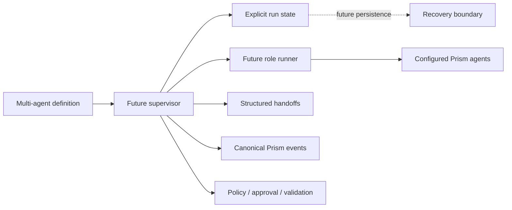
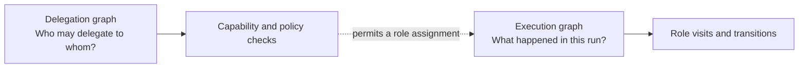

# Multi-Agent Loop Runtime Contracts

Status: Phase 1 deterministic supervisor baseline

This document defines the canonical vocabulary and ownership boundaries for
Prism's bounded multi-agent loop runtime. The contract baseline arrived in PR2;
PR3 adds deterministic in-memory supervision. Real agent integration,
persistence, recovery, and the end-to-end product flow remain later stages.

The contracts follow [Package Boundaries](PACKAGE_BOUNDARIES.md) and preserve
the authority model in
[ADR 0001](decisions/0001-runtime-owns-authority.md).

## Purpose

Phase 1 introduces one governed reference flow:

```text
Planner -> Developer -> Tester -> Reviewer -> Complete
               ^          |           |
               |          | failed    | changes requested
               +----------+-----------+
```

The flow is intentionally bounded. Roles may perform local iterations, but
Prism owns global routing, budgets, terminal outcomes, and the durable state
required for eventual recovery.

This contract baseline makes later implementation PRs depend on one vocabulary
instead of inventing incompatible role names, statuses, handoffs, transition
outcomes, budget semantics, or event payloads.

## Package placement decision

Package: `internal/workflow/multiagent`

Domain statement: owns the canonical contracts and deterministic in-memory
supervision semantics for bounded multi-agent workflows.

Invariants owned:

- Phase 1 role and outcome vocabulary;
- role configuration validity;
- deterministic transition-rule shape;
- structured handoff validity;
- explicit run and role state validity;
- terminal-condition consistency;
- fail-closed budget configuration;
- deterministic transition selection; and
- bounded correction-loop traversal.

Primary callers:

- the real Prism agent adapter introduced in PR4;
- the persistence and recovery boundary introduced in PR5; and
- composition roots that start a multi-agent run.

Allowed dependencies:

- the Go standard library;
- `internal/cost` for the existing token-usage contract;
- `internal/retry` for the existing retry policy;
- `internal/validation` for existing validation results; and
- `internal/event` for the canonical Prism event envelope and vocabulary.

Responsibilities explicitly excluded:

- invoking or selecting real agents;
- persisting state;
- evaluating policy;
- recording approvals;
- running validation commands;
- managing worktrees; and
- transporting delegated work.

Existing packages considered:

- `internal/workflow`;
- `internal/workflow/v2`;
- `internal/delegation`; and
- `internal/subagent`.

Those packages do not own this contract domain. `workflow` is the generic
ordered workflow engine. `workflow/v2` owns the current Natural Gates runtime.
`delegation` owns capability-gated task routing. `subagent` owns bounded agent
execution. Putting the new contracts into one of those packages would either
couple the supervisor to an existing execution engine or make an
execution/transport package the owner of workflow semantics.

Test boundary: contract validation and JSON round trips are tested without
NATS, SQLite, providers, worktrees, or live agents.

## System context



`internal/workflow/multiagent` owns the definition, state, and handoff
contracts. The supervisor owns orchestration. `internal/event` owns
event names and payload schemas. Existing governance packages retain authority.

## Terminology

| Term | Meaning |
| --- | --- |
| Role | A logical workflow responsibility, independent of a concrete agent ID |
| Role configuration | The mapping from a logical role to an existing agent or profile and its bounds |
| Local iteration | One bounded attempt performed within a role |
| Visit | One entry into a role; correction loops create additional visits |
| Handoff | Structured context transferred from one role to the next |
| Transition outcome | A typed result returned by a role for Prism to route |
| Transition rule | A declared mapping from role and outcome to a role or terminal condition |
| Traversal | One selected transition in the execution history |
| Run state | The complete logical state required to observe and eventually resume a run |
| Terminal condition | The typed reason that no further role may execute |
| Delegation graph | The permission relationships governing which agents may delegate to which targets |
| Execution graph | The actual role and transition history of one run |

## Responsibilities and boundaries

| Concern | Owner |
| --- | --- |
| Role, outcome, handoff, budget, and state invariants | `internal/workflow/multiagent` |
| Generic workflow execution | `internal/workflow` |
| Natural Gates execution | `internal/workflow/v2` |
| Agent identity and configured profiles | Existing agent and orchestrator domains |
| Capability-gated delegation | `internal/delegation` |
| Bounded sub-agent execution | `internal/subagent` |
| Event envelope, names, and payload schema | `internal/event` |
| Authorization decisions | `internal/policy` |
| Human authorization records | `internal/approval` |
| Allowlisted verification | `internal/validation` |
| Persistence mechanics | A storage boundary introduced in PR5 |

The contract package coordinates none of these concerns. It gives their future
composition a shared, validated language.

## Role contracts

The initial logical roles are:

- `planner`;
- `developer`;
- `tester`; and
- `reviewer`.

A role is not an agent. `AgentRef` identifies an existing Prism agent or
profile that a later adapter resolves. This separation allows a deployment to
change its configured agents without changing workflow meaning.

Each role configuration records:

- the logical role;
- the agent or profile reference;
- allowed tools and required capabilities;
- maximum local iterations;
- token and time budgets;
- the existing Prism retry policy;
- approval requirements; and
- validation-profile references.

Tool names, capabilities, agent references, and validation profiles remain
references. PR4 resolves them against the actual configured Prism registries.
The PR2 contract validates their shape without importing orchestration or
execution implementations.

Approval requirements name approver roles. A role cannot name itself as an
approver. The configuration only expresses workflow routing; the approval
package remains responsible for recording and resolving human authority.

## Role and run statuses

Role execution statuses are explicit:

| Status | Meaning |
| --- | --- |
| `pending` | The role has not entered its current visit |
| `running` | The role is performing bounded local work |
| `waiting` | The role awaits an external governed condition |
| `completed` | The role produced a valid outcome |
| `failed` | The role could not complete its work |
| `blocked` | A required condition prevents progress |
| `cancelled` | The role stopped because the run was cancelled |

Run status is separate because one role can fail while the run enters a
correction loop. Terminal run statuses are `completed`, `failed`, `cancelled`,
and `budget_exhausted`. `created`, `running`, and `paused` remain resumable
logical states.

## Structured handoffs

A handoff is the primary contract between roles. It contains:

- handoff and run IDs;
- source and destination roles;
- a task reference and objective;
- typed artifact and evidence references;
- a typed transition outcome and reason;
- existing Prism validation results;
- structured unresolved issues; and
- a creation timestamp.

Artifact references identify files, commits, pull requests, reports, or
validation artifacts without embedding their content in workflow state.
Free-form notes are permitted as supplemental context, but notes cannot select
a destination or outcome.

A valid handoff must:

- reference roles present in the definition;
- match a declared non-terminal transition;
- use a supported outcome for its source role;
- use different source and destination roles unless the definition explicitly
  permits self-transitions;
- contain a task, objective, transition reason, and timestamp; and
- contain valid artifact, validation-result, and issue structures.

## Transition outcomes

Agents report typed outcomes. They do not name arbitrary destinations. The
supervisor matches an outcome to a validated transition rule.

| Source role | Outcome | Phase 1 meaning | Reference result |
| --- | --- | --- | --- |
| Planner | `plan_ready` | A structured implementation plan is ready | Developer |
| Developer | `implementation_ready` | Implementation and evidence are ready for testing | Tester |
| Tester | `tests_passed` | Required validation passed | Reviewer |
| Tester | `tests_failed` | Validation failed and requires correction | Developer |
| Reviewer | `review_approved` | Independent review approves completion | Complete |
| Reviewer | `changes_requested` | Review requires correction | Developer |
| Any configured role | `terminal_failure` | The run cannot continue safely | Failed |
| Any configured role | `cancelled` | Cancellation was requested | Cancelled |

Contract validation rejects:

- unknown roles or outcomes;
- outcomes emitted by the wrong role;
- routes with both a destination and terminal condition;
- routes with neither;
- duplicate routes for the same role and outcome;
- undeclared transitions;
- non-terminal outcomes used as terminal outcomes; and
- self-transitions unless explicitly allowed.

Transition selection is owned by the PR3 supervisor and uses typed outcomes only.

## State ownership

The supervisor is the single logical writer of multi-agent run state.
Agents return role results and handoffs; they do not mutate global state.

`RunState` records:

- a state schema version;
- run and workflow definition identity;
- current role and task;
- run status;
- per-role status, visits, local iterations, retries, token usage, elapsed time,
  and latest outcome;
- total transition and correction-loop traversal counts;
- accumulated token, iteration, retry, failure, and elapsed-time usage;
- creation, update, and completion timestamps;
- the latest structured handoff; and
- a typed terminal outcome.

State validation requires every configured role to have an explicit role state.
Counters and usage cannot be negative. Terminal status, condition, completion
timestamp, and reason must agree. Active states cannot carry a terminal
outcome.

PR2 proves JSON round-trip behavior. It does not choose a database, artifact
path, checkpoint protocol, lease model, or atomic-write strategy.

## Budget model

Budgets exist at run and role levels.

| Budget | Scope |
| --- | --- |
| Maximum transitions | Whole run |
| Maximum visits per role | Whole run, keyed by role |
| Maximum local iterations | Whole run and per role |
| Maximum retries | Whole run; role retry policy may be stricter |
| Maximum tokens | Whole run and per role |
| Maximum repeated failures | Whole run |
| Maximum tester-to-developer traversals | Tester correction loop |
| Maximum reviewer-to-developer traversals | Reviewer correction loop |
| Maximum duration | Whole run and per role |

Count and token limits use a fail-closed convention:

- a positive value is a bounded ceiling;
- `-1` is explicitly unlimited; and
- `0` and values below `-1` are invalid.

Duration limits use the same positive-or-`-1` rule. The existing
`retry.RetryConfig` retains its established convention that zero retries means
no retry.

Budget exhaustion is not a generic failure string. It is represented by the
typed `budget_exhausted` run status and terminal condition and has a dedicated
canonical event.

## Event model

Multi-agent events use the existing `event.Event` envelope, metadata,
correlation IDs, parent IDs, event store, and opt-in payload validation. The
supervisor emits this vocabulary through an injected sink; it does not
introduce another event bus or envelope.

The namespace is `prism.workflow.multi_agent.*`.

| Event | Payload contract |
| --- | --- |
| `run.created` | Run ID, workflow ID, status |
| `run.started` | Run ID, workflow ID, status |
| `role.entered` | Run, workflow, role, status, visit |
| `role.iteration.started` | Run, workflow, role, status, iteration |
| `role.iteration.completed` | Role iteration plus optional outcome, usage, error, and artifacts |
| `role.completed` | Role, status, outcome, and optional evidence summary |
| `handoff.created` | Handoff, source, destination, task, and outcome |
| `transition.selected` | Source, outcome, destination or terminal condition, transition count |
| `loop.traversal.recorded` | The selected traversal and accumulated transition count |
| `budget.warning` | Budget name, used value, limit, and optional role |
| `budget.exhausted` | Exhausted budget and typed terminal reason |
| `run.paused` | Run identity, paused status, and optional reason |
| `run.resumed` | Run identity, resumed status, and optional reason |
| `run.completed` | Completed status and terminal condition |
| `run.failed` | Failed status, terminal condition, and reason |
| `run.cancelled` | Cancelled status, terminal condition, and reason |

The full canonical names and typed payload structs live in `internal/event`.
Their required fields are registered with the existing `event.Schemas` map.

## Deterministic supervisor

`Supervisor` executes the validated Phase 1 definition in memory. A
`TransitionResolver` maps only the pair `(current role, typed outcome)` to one
declared destination or terminal condition. Free-form role output never
participates in route selection.


### Role runner boundary

A role runner receives:

- a copy-only `RunView` with identity, task, counters, usage, and the incoming
  handoff;
- the current `RoleConfig`; and
- the execution context.

It returns a typed outcome, a routing-free handoff draft, token and iteration
usage, retry accounting, execution metadata, and an error. The handoff draft
contains artifacts and evidence but no source or destination role. The
supervisor resolves the edge and constructs the canonical `Handoff`.

### Supervisor invariants

For every run:

- only the supervisor mutates `RunState`;
- exactly one declared transition is selected for a valid role outcome;
- a runner cannot name or mutate the next role;
- visit, transition, loop, iteration, retry, token, and elapsed-time accounting
  is explicit;
- every configured limit is checked before another role can execute;
- terminal state, condition, timestamp, and event agree;
- cancellation is checked between role executions and after runner return; and
- no role executes after completion, failure, cancellation, or budget
  exhaustion.

### Event ordering

A successful non-terminal visit emits:

```text
role.entered
role.completed
handoff.created
transition.selected
loop.traversal.recorded  # correction edges only
```

A run begins with `run.started`. Its final event is `run.completed`,
`run.failed`, `run.cancelled`, or `budget.exhausted`, according to the typed
terminal state. Runner errors and invalid outcomes fail deterministically;
budget exhaustion records the attempted usage and does not select the
over-budget transition.

## Workflow-engine relationship

The multi-agent runtime is workflow-first. It will be composed as a workflow
capability rather than replacing either existing workflow engine.

- `internal/workflow` continues to own generic named-step execution.
- `internal/workflow/v2` continues to own Natural Gates behavior and state.
- `internal/workflow/multiagent` owns the stable contracts and deterministic
  in-memory supervision.
- PR3 supplies the tested supervisor and narrow role-runner boundary.
- Later integration may adapt an existing workflow step or runtime entry point
  to the supervisor without moving current packages.

No current production workflow is wired to the supervisor in PR3.

## Delegation graph and execution graph

The graphs answer different questions:



The delegation graph governs permission. It contains agent relationships and
capability constraints. The execution graph records runtime progress: role
visits, outcomes, correction loops, and terminal state.

An execution edge is valid only when delegation and governance permit the
underlying assignment. Permission does not imply that the edge executed, and
an executed edge does not grant new delegation authority. The graphs are
related but never interchangeable.

## Security and governance invariants

- Agents perform bounded local work.
- Prism owns global routing and terminal decisions.
- Agents return typed outcomes and cannot directly control arbitrary
  transitions.
- Delegation may narrow authority but cannot widen it.
- No role may approve its own work.
- Policy, approval, and validation remain independent authority domains.
- All loop state is explicit and persistable.
- Every effect remains subject to the existing event, policy, approval,
  validation, and audit path.

## Compatibility decisions

- Logical roles are separate from current agent IDs and role strings.
- Agent and profile references remain strings until PR4 resolves them against
  live registries.
- Existing `retry.RetryConfig`, `validation.Result`, and `cost.TokenUsage`
  contracts are reused.
- Existing Natural Gates state is not embedded in multi-agent state.
- Existing delegated-task artifacts can be translated into typed artifact
  references without coupling the contract package to `workflow/v2`.
- Multi-agent events extend the canonical event schema and do not reuse
  unprefixed `workflow.*` engine-internal event names.
- Schema version `1` gives PR5 a migration boundary without selecting a
  persistence format now.

## Explicit non-goals

PR3 does not:

- invoke real agents;
- wire production workflows;
- persist or resume multi-agent state;
- modify the dashboard;
- build a graph editor;
- support arbitrary user-authored graphs;
- execute roles in parallel;
- distribute execution;
- create agents dynamically;
- permit unbounded loops; or
- restructure existing packages.

## Follow-up PRs

### Completed foundation: PR3 deterministic supervisor

PR3 consumes the contracts through an injected role runner, deterministic
transition resolution, fail-closed budget enforcement, canonical event
ordering, cancellation checks, explicit state accounting, and bounded loop
tests. It invokes no real agents and adds no persistence.

### PR4: real Prism agent integration

Adapt configured Prism agents and profiles to the PR3 role-runner boundary.
Resolve tool and capability scopes, structured outputs, governance, and
workspaces without moving routing authority into agents.

### PR5: persistence, recovery, and resume

Persist the versioned state contract, define atomic checkpoints, leases or
claims, idempotency, recovery APIs, and deterministic resume behavior.

### PR6: first end-to-end demo flow

Expose one safe reference flow using the real supervisor and agents, with run
inspection, cancellation, resume, final reporting, and Phase 1 completion
review.

## Known limitations

- Only the four Phase 1 roles and eight Phase 1 outcomes are recognized.
- Role and profile references are not resolved until the real agent adapter.
- The supervisor is in-memory and accepts injected runners; PR4 supplies the
  first real Prism agent adapter.
- State is serializable but not yet persisted.
- Events are emitted to an injected sink; production transport wiring is later.
