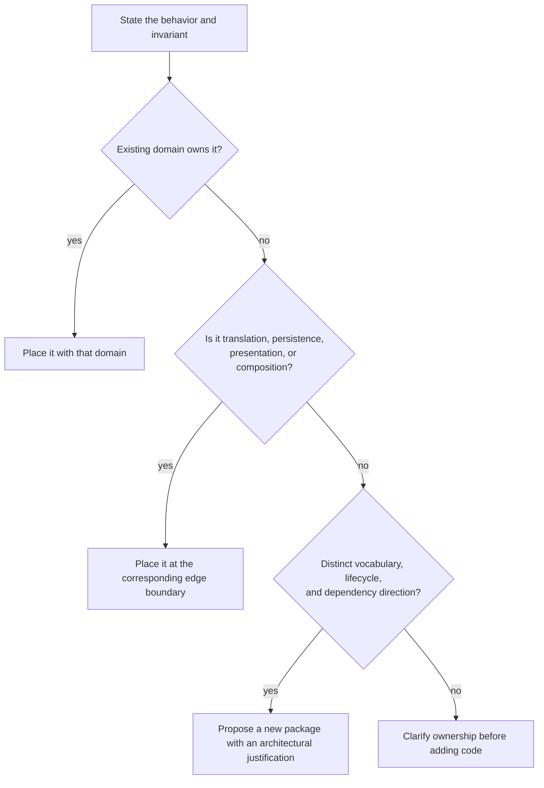

# Package Boundaries

Status: Architectural policy

This document defines the package-boundary rules for Prizm. It applies to new
code and to changes that alter ownership, dependencies, or architectural
responsibilities. It does not require a retrospective package reorganization.

The key words **MUST**, **MUST NOT**, **SHOULD**, **SHOULD NOT**, and **MAY** are
normative.

## Why package boundaries matter

In Go, a package is both a compiler-enforced dependency boundary and a statement
of architectural ownership. A good boundary tells a contributor:

- which domain owns a concept and its invariants;
- which changes should happen together;
- which dependencies are permitted;
- which API other domains may rely on; and
- where tests for the behavior belong.

Weak boundaries make ownership implicit. They allow orchestration, persistence,
presentation, and policy decisions to accumulate in whichever package happens
to be convenient. The result may still compile, but changes become difficult to
reason about, authority leaks across trust boundaries, and apparently local
work has system-wide effects.

Prizm has an additional reason to be strict: models are untrusted generators
inside a deterministic runtime. Policy, approval, validation, persistence, and
execution authority must remain explicit. Package boundaries make those
responsibilities reviewable.

## What constitutes a package

A Go package is the set of non-test source files in one directory that declare
the same package name. Its boundary is the API imported by other packages, not
the number or size of its files.

For Prizm:

- A directory under `internal/` is a package boundary. The `internal` mechanism
  limits who may import it; it does not by itself make the package cohesive.
- A subpackage is an independent package, not a private namespace of its parent.
  For example, `internal/tool/mcp` must have its own responsibility and
  dependency rules.
- A `cmd/` package is a composition root. It selects configuration, constructs
  components, and starts a process. It must not become the owner of domain
  behavior merely because it wires that behavior together.
- Test files may use the package under test or an external `_test` package.
  That choice does not create a production domain.
- A subsystem may contain several packages when it contains several bounded
  responsibilities. Conversely, a single coherent package may contain many
  files.

File boundaries organize source. Package boundaries organize authority.

## Bounded domains, not helper categories

A Prizm package SHOULD represent a bounded domain: a cohesive area with its own
vocabulary, invariants, and reason to change. Its name should describe the
concept it owns.

A package is cohesive when its contents:

- use the same domain language;
- enforce the same invariants;
- change for the same class of reason;
- can be understood and tested as one unit; and
- expose a narrow contract to the rest of the system.

Code is not cohesive merely because it:

- appears in the same request path;
- is used by the same feature;
- was written at the same time;
- avoids adding an import;
- is called by an orchestrator; or
- was extracted from a large file.

Package size is evidence of neither good nor bad design. A small package can own
an important boundary. A large package can remain cohesive. Contributors MUST
NOT create a package solely because a file or directory is getting large.

Names such as `util`, `utils`, `helper`, `helpers`, `common`, `misc`, and
`shared` describe reuse or convenience rather than ownership. New packages with
those roles are prohibited unless an architectural review demonstrates a
specific bounded domain and gives it a domain name.

## Prizm domain map

The following names are the preferred architectural vocabulary. They describe
bounded responsibilities, not a mandate to create, merge, move, or rename
current packages.

| Domain | Owns | Does not own | Current Prizm anchors |
| --- | --- | --- | --- |
| Runtime | Process and run lifecycle, composition, and system supervision | Workflow semantics, policy decisions, or UI behavior | `internal/run`, `internal/orchestrator` |
| Workflow | Workflow definitions, execution semantics, progress, and completion | Agent identity, approval authority, transport, or storage mechanics | `internal/workflow` |
| Agents | Agent identity, capabilities, assignment, delegation, and result contracts | Workflow structure or permission escalation | `internal/agent`, `internal/agentns`, `internal/delegation`, `internal/subagent` |
| Memory | Recall and capture semantics and memory lifecycle | Provider-specific RPC or general persistence | `internal/remembrance` is the current Remembrance integration |
| Governance | Cross-cutting authority model and auditable control relationships | A catch-all for every safety-related function | Expressed today through policy, approval, validation, safety, and guard domains |
| Policy | Deterministic authorization rules and decisions | Human consent, command execution, or result validation | `internal/policy` |
| Approval | Human authorization requests, decisions, identity, and audit state | Policy evaluation or mutation execution | `internal/approval` |
| Validation | Allowlisted verification profiles, execution, and results | Granting permission or approving mutations | `internal/validation` |
| Events | Canonical event vocabulary, envelopes, and event contracts | Broker operation or the domain rules that cause an event | `internal/event` |
| Dashboard | Operator-facing presentation and dashboard-specific read models | Runtime authority or domain mutation rules | `internal/dashboard`, `internal/editor` |
| Transport | Delivery protocols and connection lifecycle | Domain decisions encoded only in a protocol handler | `internal/bus`, `internal/sse`, bridge and adapter packages |
| Storage | Persistence mechanisms and storage-specific behavior | The meaning of workflow, agent, or approval state | `internal/sqlite` and domain stores |
| API | Public request, response, authentication, and compatibility contracts | The domain behavior reached through an endpoint | `internal/api` |

Tool and provider integrations belong at the system edge. `internal/tool/mcp`
adapts MCP servers into Prizm's tool contract; provider packages adapt model
services into Prizm's provider contract. An adapter may translate, validate
protocol shape, and manage an external connection. It MUST NOT become an
alternate authority path around policy, approval, validation, or persistence.

Some current packages predate this policy or use narrower names than the domain
vocabulary above. This document governs future decisions; it is not permission
for opportunistic cleanup.

## Ownership and dependency rules

### Put invariants with the domain that owns them

The package that can state an invariant in domain language owns the code that
enforces it. A caller may coordinate the operation, but coordination does not
transfer ownership.

For example:

- `workflow` owns whether a workflow transition is valid.
- `policy` owns the meaning of an allow or deny decision.
- `approval` owns the validity and audit identity of a human decision.
- `validation` owns what counts as an allowed validation profile and result.
- `event` owns the canonical event envelope; it does not decide whether a
  workflow transition or mutation is permitted.

### Keep domain behavior independent of edge mechanisms

Domain packages SHOULD NOT depend on dashboard, API, broker, provider, or
database implementations. Edge packages translate between an external
mechanism and a domain contract.

When an abstraction is required, define the smallest interface in the package
that consumes it. Do not create a shared interface package merely to avoid
choosing an owner.

### Keep composition explicit

Composition packages may construct components, route lifecycle signals, and
coordinate calls. They MUST NOT absorb the rules of the components they
coordinate.

`internal/orchestrator` is allowed to wire workflows, agents, policy, tools,
events, and persistence. That does not make it the correct home for a new
workflow transition rule, policy exception, dashboard formatter, or SQLite
query.

### Preserve the authority path

No package may create a second path that allows models, agents, integrations, or
transports to bypass runtime-owned policy, approval, validation, execution, or
audit. This is the package-level consequence of
[ADR 0001](decisions/0001-runtime-owns-authority.md).

### Use events as contracts, not as hidden dependencies

Events decouple delivery and observation, but they do not erase ownership. The
domain that causes a state change owns the state-change rule. `event` owns the
shared event contract. `bus` owns delivery mechanics. Consumers must not infer
private domain behavior from undocumented payload accidents.

Go rejects import cycles. Reviewers must also reject logical cycles hidden
behind global registries, callbacks, or event ping-pong.

## Deciding where new code belongs

Use this sequence for every addition:

1. **Name the behavior in domain language.** Describe what it guarantees
   without mentioning a file, framework, protocol, or call site.
2. **Identify the invariant and authority.** Ask which domain is accountable if
   the behavior is wrong.
3. **Find the existing owner.** Prefer the existing package whose charter and
   vocabulary already include that invariant.
4. **Classify edge concerns.** Separate domain semantics from composition,
   transport, persistence, presentation, and external integration.
5. **Check dependency direction.** The proposed placement must not force a
   stable domain to import an edge implementation or create a cycle.
6. **Test the package charter.** If no existing package owns the concept, apply
   the new-package rules below. Do not create a speculative package for a
   domain that cannot yet be stated precisely.



When a feature crosses domains, split responsibility by invariant rather than
placing the entire feature in one package. Coordinate the pieces through narrow
contracts.

| Change | Placement |
| --- | --- |
| A new rule for advancing a workflow step | `workflow` |
| A canonical event shape for reporting that transition | `event`; the transition rule remains in `workflow` |
| A NATS handler that receives a workflow request | The transport/bus boundary; it calls `workflow` |
| A policy decision required before a tool mutation | `policy`; tool execution consumes the decision |
| Human decision state and audit identity | `approval`, even when requested from a workflow |
| An allowlisted verification profile and its result | `validation`, not `workflow` or `tool` |
| A SQLite representation of domain state | The storage boundary; domain meaning remains with the owning domain |
| A dashboard view of agent progress | `dashboard`; agent lifecycle remains in the agents domain |
| MCP protocol translation for tools | `internal/tool/mcp`; tool authority remains in `tool` and governance packages |
| Retry behavior unique to one provider protocol | Keep it with that provider until a broader domain contract is demonstrated |

## Rules for introducing a new package

Every architectural PR that introduces a package MUST justify it in the PR
description. The justification must be reviewable independently of the code and
must include:

```text
Package:
Domain statement:
Invariants owned:
Primary callers:
Allowed dependencies:
Responsibilities explicitly excluded:
Existing packages considered:
Why those packages do not own this domain:
Test boundary:
```

A new package is warranted only when all of the following are true:

- it has a domain name and a one-sentence responsibility;
- it owns at least one meaningful invariant or external boundary;
- its contents have a common reason to change;
- its API can be narrower than the implementation it contains;
- its dependency direction is clear and cycle-free;
- the responsibility does not already belong to an existing package; and
- it is useful for present, approved work rather than hypothetical reuse.

The following are not sufficient reasons on their own:

- a file is long;
- a package contains many files;
- two callers need similar code;
- the code feels reusable;
- a feature needs a place for its models;
- an import list would be shorter;
- a milestone has a new name; or
- an AI agent generated a separable block of code.

A technical capability may deserve a package when it has a precise, stable
contract of its own. The burden is to name that capability and its invariants,
not to call it a utility.

## Rules for adding to an existing package

An existing package is not a default destination. Before adding code, verify
that:

- the package would still have one defensible domain statement;
- the new code uses the package's existing vocabulary;
- the package owns the new invariant;
- tests can exercise the behavior without constructing unrelated subsystems;
- the addition does not reverse dependency direction; and
- the package name remains an honest description of its contents.

Do not put code in:

- `workflow` merely because a workflow invokes it;
- `orchestrator` merely because it must be wired at startup;
- `tool` merely because an agent can request it;
- `api` merely because an endpoint exposes it;
- `event` merely because it emits or consumes an event;
- `dashboard` merely because an operator can see it; or
- any large package merely because adding one more file is easy.

If an existing package and a proposed package both appear plausible, identify
which one owns the invariant. The other package should depend on a narrow
contract, translate at its boundary, or remain a caller.

## Good and bad package design

### Good: separate authority domains

Prizm keeps policy evaluation, human approval, and validation in distinct
packages. They participate in one controlled mutation lifecycle, but they do
not mean the same thing:

```text
policy      determines whether an action is permitted
approval    records human authority for a gated action
validation  verifies work using an allowlisted profile
tool        executes a permitted action
```

Combining them into `internal/governancehelpers` would hide different
authorities behind a convenience category. Putting them all in `workflow`
would make the workflow runtime the owner of rules it should only coordinate.

### Good: adapt at the edge

`internal/tool/mcp` translates an external tool protocol at the tool boundary.
The adapter does not become a policy engine. Similarly, `internal/provider`
implementations adapt model services while the Prizm runtime retains lifecycle
and effect authority.

### Good: distinguish contract from delivery

`internal/event` defines Prizm's canonical event vocabulary.
`internal/bus` provides NATS integration and embedded bus operation. Event
meaning can remain stable while delivery mechanisms evolve.

### Bad: organize by programming technique

```text
internal/
  helpers/
    json.go
    workflow.go
    approval.go
  common/
    models.go
    interfaces.go
  managers/
    runtime.go
    agents.go
```

This layout groups code by shape rather than ownership. It gives unrelated
domains a common reason to import unstable code and makes package names
uninformative.

### Bad: turn a domain into a feature drawer

```text
internal/workflow/
  runner.go
  approval_store.go
  dashboard_formatter.go
  provider_retry.go
  sqlite_queries.go
```

Only the runner is necessarily workflow behavior. The other files describe
approval, presentation, provider, and storage concerns. Their presence in the
same request path does not make them part of the same domain.

## Review checklist

Authors and reviewers MUST be able to answer these questions:

- What bounded domain owns the change?
- What invariant does that domain enforce?
- Does the package name describe ownership rather than reuse?
- Is the code placed with the invariant rather than with a convenient caller?
- Are domain semantics separated from transport, storage, UI, and integration
  mechanics?
- Do dependencies point toward stable contracts?
- Does the change preserve runtime-owned authority?
- Is the exported API no larger than its consumers require?
- Has a new package been justified using the required template?
- Would the placement still make sense if the current feature, protocol, or UI
  were replaced?

If these answers are not clear, package placement is not ready for code review.
