# System overview and trust boundaries

The framework, not the model, owns lifecycle and effects.

```mermaid
flowchart LR
  ingress["CLI / API / scheduler / integrations"] --> runtime["Prizm lifecycle"]
  runtime --> context["Context + routing + planning"]
  context --> model["Untrusted model boundary"]
  model --> proposal["Output / tool request / mutation proposal"]
  proposal --> policy["Deterministic policy + capability checks"]
  policy -->|deny| audit["Events + audit artifacts"]
  policy -->|read-only allow| tools["Tool executor"]
  policy -->|mutation| approval["Human approval gate"]
  approval --> validation["Allowlisted validation"]
  validation --> tools
  tools --> fs["Allowed filesystem roots / isolated worktree"]
  tools --> persistence["SQLite / JSONL / JetStream"]
  persistence --> audit
  integrations["Discord / MCP / providers / Remembrance / Factory"] -. "optional boundary" .-> ingress
```

The model boundary is untrusted. A model can request an action but cannot grant
policy permission, approve its own mutation, widen filesystem roots, select an
arbitrary validation command, or bypass persistence. Optional integrations are
adapters around this lifecycle and are disabled unless configured.

Filesystem operations are resolved against explicit read/write roots. Code
mutation features use isolated worktrees where supported. Run output belongs
under ignored runtime directories; sanitized examples live under `examples/`.
