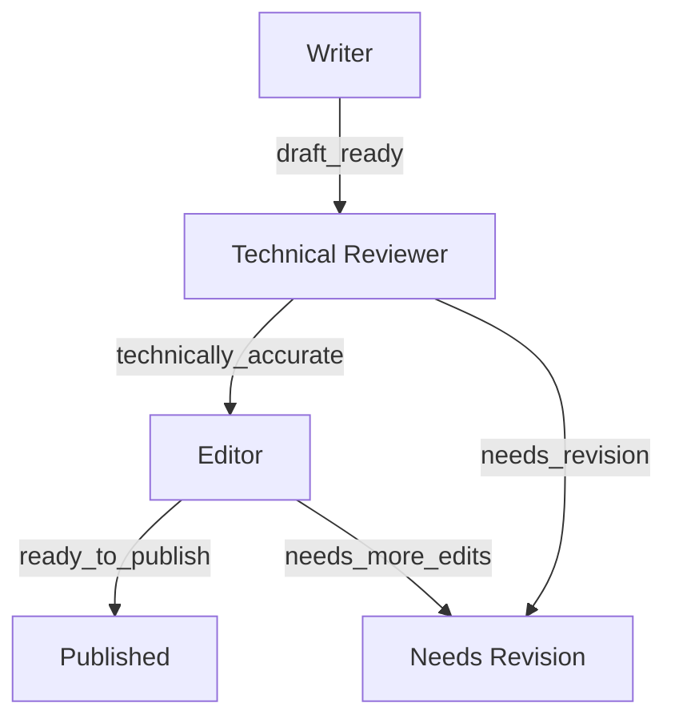

# Running and Inspecting Workflows

## `prism graph run`

```text
prism graph run \
  [--workflow <id> --version <n>] | [--file <path> [--source-ref <label>]] \
  [--input <task.json>] \
  [--workspace <dir>] [--run-dir <dir>] [--db <path>] [--config <prism.yaml>]
```

| Flag | Default | Meaning |
| --- | --- | --- |
| `--workflow` | — | Registered workflow ID to run (registry-backed mode). Mutually exclusive with `--file`. |
| `--version` | `0` (latest) | Registered version to run. |
| `--file` | — | A local workflow definition file: validate + compile + register + run, in one step (local-dev convenience). Mutually exclusive with `--workflow`. |
| `--source-ref` | — | Optional provenance label recorded when `--file` registers a new version. |
| `--input` | — | Path to a JSON task input file, e.g. `{"id":"...","description":"..."}`. |
| `--workspace` | `.` | Workspace directory the run's tools operate within. |
| `--run-dir` | `./runs` | Directory for run outputs. |
| `--db` | `./runs/multiagent_definitions.db` | Path to the definition registry SQLite database. |
| `--config` | `prism.yaml` | Path to the Prism configuration file. |

Exactly one of `--workflow` or `--file` is required.

**`--file` mode** validates and compiles the given file exactly the way
`prism graph validate`/`prism graph compile` do (diagnostics print to
stderr the same way), then registers it — printing whether a new version
was created or an unchanged existing one was reused (`ErrDefinitionUnchanged`,
see [Registry and versioning](registry-and-versioning.md)) — and starts a
run against the resolved version. This is the fast local-dev loop: edit a
YAML file, run it, iterate.

**`--workflow`/`--version` mode** is a plain registry lookup (`Latest` when
`--version` is `0` or omitted) against an already-registered definition —
the mode a CI/production caller (or the API's `POST .../run` route) uses.

Either mode prints the run ID and hints to manage it with the **existing**
`prism workflow` lifecycle verbs — there are no new lifecycle verbs for
graph-started runs, since a graph-started run is a durable multi-agent run
exactly like any other:

```text
$ prism graph run --file templates/software-delivery.yaml --input task.json --workspace ./my-project
Workflow: software-delivery v1 (fingerprint 9f2a...)
Registered software-delivery as v1.
Run ID: run_01J...
Artifacts: ./runs/run_01J...
Status: completed

To manage this run later (these existing commands work against any durable multi-agent run):
  prism workflow status run_01J... --run-dir ./runs
  prism workflow resume run_01J... --run-dir ./runs --config prism.yaml
  prism workflow cancel run_01J... --run-dir ./runs
```

Registering a second version of the same workflow later, then resuming an
older, already-started run, still resumes against the exact version that
run was pinned to at start — see
[Registry and versioning](registry-and-versioning.md#immutability-guarantees).

## `prism graph inspect`

```text
prism graph inspect --file <path> [--format text|mermaid|json]
```

In this release, `--file` (a local definition) is the **only** supported
mode — registry-backed `--workflow`/`--version` inspection is not wired up
yet (there is nothing stopping it architecturally; it just has not been
built — see [Current limitations](limitations.md)).

### `--format text` (default)

```text
$ prism graph inspect --file templates/software-delivery.yaml
Workflow: software-delivery (version 1.0.0)
Source: templates/software-delivery.yaml
Schema version: prism.dev/v1alpha1
Fingerprint: 132cd7b08a8c76f46ffd2af46b663e06f130fd235ad0e4a836eedb323aea07a2
Entry node: node:planner

Nodes:
  node:planner [role] role=planner agentProfile=planner-default
      maxVisits=1
      maxLocalIterations=3 tokenBudget=8000 timeBudget=10m0s
  ...

Transitions:
  planner:
    -> developer on "plan_ready" [plan ready]
  developer:
    -> tester on "implementation_ready" [implementation ready]
    -> terminal:failed on "blocked" [cannot proceed]
  ...

Loops:
  edge:developer:implementation_ready: maxTraversals=999 onExhausted=fail
  edge:tester:tests_failed: maxTraversals=2 onExhausted=fail
  edge:tester:tests_passed: maxTraversals=999 onExhausted=fail
  edge:reviewer:changes_requested: maxTraversals=1 onExhausted=fail

Budgets:
  maxTransitions=40 maxTokens=200000 maxLocalIterations=24 maxRetries=4 maxDuration=30m0s

Unreachable nodes:
  (none)
```

### `--format mermaid`

Emits a fenced ```` ```mermaid ```` `flowchart TD` block, ready to paste
into any Markdown renderer that supports Mermaid (including this repository's
own docs). Loop edges render as dashed arrows with a `(loop)` suffix on the
label; node/edge stable IDs are sanitized for Mermaid's identifier syntax
(`:` and `.` become `_`).

```text
$ prism graph inspect --file templates/documentation-change.yaml --format mermaid
```



### `--format json`

Prints `CompiledGraphView` — the same JSON shape `prism graph compile` and
the API's `GET .../versions/{n}/compiled` route return — with fingerprint,
schema/workflow version, nodes, edges, loops, and budgets as top-level
fields, suitable for feeding into other tooling.

## `prism graph compile`

```text
prism graph compile <file> [--out <file>]
```

Loads and compiles exactly one definition, printing (or writing to `--out`)
`CompiledGraphView` as indented JSON. On failure, diagnostics print to
stderr and the command exits non-zero.
